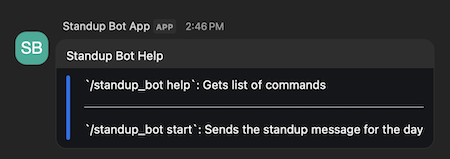
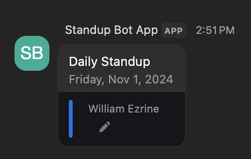
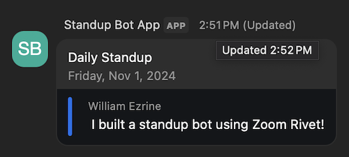

# Standup Chatbot Zoom Rivet for JavaScript

Use of this sample app is subject to our [Terms of Use](https://explore.zoom.us/en/legal/zoom-api-license-and-tou/).

This is a sample app using Zoom Rivet for JavaScript

## Installation
Run the following command to clone the repository:

```
$ git clone https://github.com/zoom/rivet-js-sample.git
```

## Setup

1. Navigate to the repository via command line:

```
cd rivet-sample-app
```

2. Install the dependencies:

```
npm install
```

3. Create an environment file to store your credentials:

```
$ touch .env
```

4. Obtain your `Client Id`, `Client Secret`, and `Secret Token` from the [App Marketplace](https://marketplace.zoom.us/). If you have not created a Chatbot, follow [these steps](https://developers.zoom.us/docs/team-chat-apps/create-chatbot/) to create a Chatbot App on the Zoom App Marketplace. **Make sure to mark your app as Admin-managed in the Basic Information section while setting up your app!**

5. Enter your `Client Id`, `Client Secret`, and `Secret Token` into your newly created environment file:

```
CLIENT_ID="CLIENT_ID_HERE"
CLIENT_SECRET="CLIENT_SECRET_HERE"
WEBHOOK_SECRET_TOKEN="SECRET_TOKEN_HERE"
```

6. Start your local development server using the following command:

```
node index.js
```

7. Now that you have your local server running, we need to use [ngrok](https://ngrok.com/docs/http/) to expose the two ports and allow Zoom Rivet to listen to the chatbot's webhook events.

Usually ngrok allows forwarding a single port, but if you add the following to your ngrok configuration file, you can serve up both with a single command:

```
version: 2
authtoken: [YOUR_AUTH_TOKEN]
tunnels:
chatbot:
    proto: http
    addr: 4001
teamchat:
    proto: http
    addr: 4002
```

```
ngrok start --all
```

8. ngrok will provide two `forwarding addresses`. Copy port `4001` URL and add it to the **Bot Endpoint URL** field in the **Surface -> Team Chat** section of the App Marketplace page for your chatbot, followed by `/zoom/events`.

9. Take the forwarding address for port `4002` and add it to the **Event notification endpoint URL** field in the **Access -> Event Subscription** section of the App Marketplace page for your chatbot, followed by `/zoom/events`.

10. Finally, you must Authorize by visiting the page provided by Rivet at `http://localhost:4002/zoom/oauth/install`. See [Authorizing with Zoom](https://developers.zoom.us/docs/integrations/oauth/) for more information.

## Usage

1. On your Zoom Team Chat Chatbot App's Credentials section, go to the Local Test or Submit page depending on which envoirnment you are using (Development or Production), and click "Add". After authorizing, go to Zoom Team Chat and see a message from the Standup Chatbot.

2. In any channel, type the following slash command to see a list of commands available:
```
/standup-bot help
```



3. Use the following slash command to start the standup. The standup bot will automatically list each member of the channel and give them a field to provide their standup for the day.

```
/standup-bot start
```



4. When a channel member edits the standup form field, the standup bot will automatically update the original message and remove the editable property of the field.



## Need help?

For more information, follow the [Rivet documentation]().

If you're looking for help, try [Developer Support](https://developers.zoom.us/support/) or our [Developer Forum](https://devforum.zoom.us/). Priority support is also available with [Premier Developer Support](https://explore.zoom.us/en/support-plans/developer/) plans.